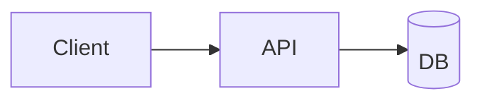

# Api Doc 03

This is a synthetic markdown document used to stress-test Crit PR rendering.

## Overview

Paragraph about **overview** in `Api Doc 03`. Paragraph about **overview** in `Api Doc 03`. Paragraph about **overview** in `Api Doc 03`. Paragraph about **overview** in `Api Doc 03`. Paragraph about **overview** in `Api Doc 03`. Paragraph about **overview** in `Api Doc 03`. Paragraph about **overview** in `Api Doc 03`. Paragraph about **overview** in `Api Doc 03`. 

```js
function example3() {
  const value = 'overview';
  return value.split('_').map(s => s.toUpperCase()).join('-');
}
```

| Col A | Col B | Col C |
| --- | --- | --- |
| Overview 1 | value-1 | note-1 |
| Overview 2 | value-2 | note-2 |
| Overview 3 | value-3 | note-3 |
| Overview 4 | value-4 | note-4 |
| Overview 5 | value-5 | note-5 |

> Tip: review this section carefully for consistency.


## Getting Started

Paragraph about **getting started** in `Api Doc 03`. Paragraph about **getting started** in `Api Doc 03`. Paragraph about **getting started** in `Api Doc 03`. Paragraph about **getting started** in `Api Doc 03`. Paragraph about **getting started** in `Api Doc 03`. Paragraph about **getting started** in `Api Doc 03`. Paragraph about **getting started** in `Api Doc 03`. Paragraph about **getting started** in `Api Doc 03`. 

```js
function example3() {
  const value = 'getting_started';
  return value.split('_').map(s => s.toUpperCase()).join('-');
}
```

| Col A | Col B | Col C |
| --- | --- | --- |
| Getting Started 1 | value-1 | note-1 |
| Getting Started 2 | value-2 | note-2 |
| Getting Started 3 | value-3 | note-3 |
| Getting Started 4 | value-4 | note-4 |
| Getting Started 5 | value-5 | note-5 |

> Tip: review this section carefully for consistency.


## Architecture

Paragraph about **architecture** in `Api Doc 03`. Paragraph about **architecture** in `Api Doc 03`. Paragraph about **architecture** in `Api Doc 03`. Paragraph about **architecture** in `Api Doc 03`. Paragraph about **architecture** in `Api Doc 03`. Paragraph about **architecture** in `Api Doc 03`. Paragraph about **architecture** in `Api Doc 03`. Paragraph about **architecture** in `Api Doc 03`. 

```js
function example3() {
  const value = 'architecture';
  return value.split('_').map(s => s.toUpperCase()).join('-');
}
```

| Col A | Col B | Col C |
| --- | --- | --- |
| Architecture 1 | value-1 | note-1 |
| Architecture 2 | value-2 | note-2 |
| Architecture 3 | value-3 | note-3 |
| Architecture 4 | value-4 | note-4 |
| Architecture 5 | value-5 | note-5 |

> Tip: review this section carefully for consistency.




## Configuration

Paragraph about **configuration** in `Api Doc 03`. Paragraph about **configuration** in `Api Doc 03`. Paragraph about **configuration** in `Api Doc 03`. Paragraph about **configuration** in `Api Doc 03`. Paragraph about **configuration** in `Api Doc 03`. Paragraph about **configuration** in `Api Doc 03`. Paragraph about **configuration** in `Api Doc 03`. Paragraph about **configuration** in `Api Doc 03`. 

```js
function example3() {
  const value = 'configuration';
  return value.split('_').map(s => s.toUpperCase()).join('-');
}
```

| Col A | Col B | Col C |
| --- | --- | --- |
| Configuration 1 | value-1 | note-1 |
| Configuration 2 | value-2 | note-2 |
| Configuration 3 | value-3 | note-3 |
| Configuration 4 | value-4 | note-4 |
| Configuration 5 | value-5 | note-5 |

> Tip: review this section carefully for consistency.


## Authentication

Paragraph about **authentication** in `Api Doc 03`. Paragraph about **authentication** in `Api Doc 03`. Paragraph about **authentication** in `Api Doc 03`. Paragraph about **authentication** in `Api Doc 03`. Paragraph about **authentication** in `Api Doc 03`. Paragraph about **authentication** in `Api Doc 03`. Paragraph about **authentication** in `Api Doc 03`. Paragraph about **authentication** in `Api Doc 03`. 

```js
function example3() {
  const value = 'authentication';
  return value.split('_').map(s => s.toUpperCase()).join('-');
}
```

| Col A | Col B | Col C |
| --- | --- | --- |
| Authentication 1 | value-1 | note-1 |
| Authentication 2 | value-2 | note-2 |
| Authentication 3 | value-3 | note-3 |
| Authentication 4 | value-4 | note-4 |
| Authentication 5 | value-5 | note-5 |

> Tip: review this section carefully for consistency.


## API Reference

Paragraph about **api reference** in `Api Doc 03`. Paragraph about **api reference** in `Api Doc 03`. Paragraph about **api reference** in `Api Doc 03`. Paragraph about **api reference** in `Api Doc 03`. Paragraph about **api reference** in `Api Doc 03`. Paragraph about **api reference** in `Api Doc 03`. Paragraph about **api reference** in `Api Doc 03`. Paragraph about **api reference** in `Api Doc 03`. 

```js
function example3() {
  const value = 'api_reference';
  return value.split('_').map(s => s.toUpperCase()).join('-');
}
```

| Col A | Col B | Col C |
| --- | --- | --- |
| API Reference 1 | value-1 | note-1 |
| API Reference 2 | value-2 | note-2 |
| API Reference 3 | value-3 | note-3 |
| API Reference 4 | value-4 | note-4 |
| API Reference 5 | value-5 | note-5 |

> Tip: review this section carefully for consistency.


## Error Handling

Paragraph about **error handling** in `Api Doc 03`. Paragraph about **error handling** in `Api Doc 03`. Paragraph about **error handling** in `Api Doc 03`. Paragraph about **error handling** in `Api Doc 03`. Paragraph about **error handling** in `Api Doc 03`. Paragraph about **error handling** in `Api Doc 03`. Paragraph about **error handling** in `Api Doc 03`. Paragraph about **error handling** in `Api Doc 03`. 

```js
function example3() {
  const value = 'error_handling';
  return value.split('_').map(s => s.toUpperCase()).join('-');
}
```

| Col A | Col B | Col C |
| --- | --- | --- |
| Error Handling 1 | value-1 | note-1 |
| Error Handling 2 | value-2 | note-2 |
| Error Handling 3 | value-3 | note-3 |
| Error Handling 4 | value-4 | note-4 |
| Error Handling 5 | value-5 | note-5 |

> Tip: review this section carefully for consistency.


## Performance

Paragraph about **performance** in `Api Doc 03`. Paragraph about **performance** in `Api Doc 03`. Paragraph about **performance** in `Api Doc 03`. Paragraph about **performance** in `Api Doc 03`. Paragraph about **performance** in `Api Doc 03`. Paragraph about **performance** in `Api Doc 03`. Paragraph about **performance** in `Api Doc 03`. Paragraph about **performance** in `Api Doc 03`. 

```js
function example3() {
  const value = 'performance';
  return value.split('_').map(s => s.toUpperCase()).join('-');
}
```

| Col A | Col B | Col C |
| --- | --- | --- |
| Performance 1 | value-1 | note-1 |
| Performance 2 | value-2 | note-2 |
| Performance 3 | value-3 | note-3 |
| Performance 4 | value-4 | note-4 |
| Performance 5 | value-5 | note-5 |

> Tip: review this section carefully for consistency.


## Security

Paragraph about **security** in `Api Doc 03`. Paragraph about **security** in `Api Doc 03`. Paragraph about **security** in `Api Doc 03`. Paragraph about **security** in `Api Doc 03`. Paragraph about **security** in `Api Doc 03`. Paragraph about **security** in `Api Doc 03`. Paragraph about **security** in `Api Doc 03`. Paragraph about **security** in `Api Doc 03`. 

```js
function example3() {
  const value = 'security';
  return value.split('_').map(s => s.toUpperCase()).join('-');
}
```

| Col A | Col B | Col C |
| --- | --- | --- |
| Security 1 | value-1 | note-1 |
| Security 2 | value-2 | note-2 |
| Security 3 | value-3 | note-3 |
| Security 4 | value-4 | note-4 |
| Security 5 | value-5 | note-5 |

> Tip: review this section carefully for consistency.


## Deployment

Paragraph about **deployment** in `Api Doc 03`. Paragraph about **deployment** in `Api Doc 03`. Paragraph about **deployment** in `Api Doc 03`. Paragraph about **deployment** in `Api Doc 03`. Paragraph about **deployment** in `Api Doc 03`. Paragraph about **deployment** in `Api Doc 03`. Paragraph about **deployment** in `Api Doc 03`. Paragraph about **deployment** in `Api Doc 03`. 

```js
function example3() {
  const value = 'deployment';
  return value.split('_').map(s => s.toUpperCase()).join('-');
}
```

| Col A | Col B | Col C |
| --- | --- | --- |
| Deployment 1 | value-1 | note-1 |
| Deployment 2 | value-2 | note-2 |
| Deployment 3 | value-3 | note-3 |
| Deployment 4 | value-4 | note-4 |
| Deployment 5 | value-5 | note-5 |

> Tip: review this section carefully for consistency.


## Monitoring

Paragraph about **monitoring** in `Api Doc 03`. Paragraph about **monitoring** in `Api Doc 03`. Paragraph about **monitoring** in `Api Doc 03`. Paragraph about **monitoring** in `Api Doc 03`. Paragraph about **monitoring** in `Api Doc 03`. Paragraph about **monitoring** in `Api Doc 03`. Paragraph about **monitoring** in `Api Doc 03`. Paragraph about **monitoring** in `Api Doc 03`. 

```js
function example3() {
  const value = 'monitoring';
  return value.split('_').map(s => s.toUpperCase()).join('-');
}
```

| Col A | Col B | Col C |
| --- | --- | --- |
| Monitoring 1 | value-1 | note-1 |
| Monitoring 2 | value-2 | note-2 |
| Monitoring 3 | value-3 | note-3 |
| Monitoring 4 | value-4 | note-4 |
| Monitoring 5 | value-5 | note-5 |

> Tip: review this section carefully for consistency.


## Troubleshooting

Paragraph about **troubleshooting** in `Api Doc 03`. Paragraph about **troubleshooting** in `Api Doc 03`. Paragraph about **troubleshooting** in `Api Doc 03`. Paragraph about **troubleshooting** in `Api Doc 03`. Paragraph about **troubleshooting** in `Api Doc 03`. Paragraph about **troubleshooting** in `Api Doc 03`. Paragraph about **troubleshooting** in `Api Doc 03`. Paragraph about **troubleshooting** in `Api Doc 03`. 

```js
function example3() {
  const value = 'troubleshooting';
  return value.split('_').map(s => s.toUpperCase()).join('-');
}
```

| Col A | Col B | Col C |
| --- | --- | --- |
| Troubleshooting 1 | value-1 | note-1 |
| Troubleshooting 2 | value-2 | note-2 |
| Troubleshooting 3 | value-3 | note-3 |
| Troubleshooting 4 | value-4 | note-4 |
| Troubleshooting 5 | value-5 | note-5 |

> Tip: review this section carefully for consistency.


## FAQ

Paragraph about **faq** in `Api Doc 03`. Paragraph about **faq** in `Api Doc 03`. Paragraph about **faq** in `Api Doc 03`. Paragraph about **faq** in `Api Doc 03`. Paragraph about **faq** in `Api Doc 03`. Paragraph about **faq** in `Api Doc 03`. Paragraph about **faq** in `Api Doc 03`. Paragraph about **faq** in `Api Doc 03`. 

```js
function example3() {
  const value = 'faq';
  return value.split('_').map(s => s.toUpperCase()).join('-');
}
```

| Col A | Col B | Col C |
| --- | --- | --- |
| FAQ 1 | value-1 | note-1 |
| FAQ 2 | value-2 | note-2 |
| FAQ 3 | value-3 | note-3 |
| FAQ 4 | value-4 | note-4 |
| FAQ 5 | value-5 | note-5 |

> Tip: review this section carefully for consistency.


## Changelog

Paragraph about **changelog** in `Api Doc 03`. Paragraph about **changelog** in `Api Doc 03`. Paragraph about **changelog** in `Api Doc 03`. Paragraph about **changelog** in `Api Doc 03`. Paragraph about **changelog** in `Api Doc 03`. Paragraph about **changelog** in `Api Doc 03`. Paragraph about **changelog** in `Api Doc 03`. Paragraph about **changelog** in `Api Doc 03`. 

```js
function example3() {
  const value = 'changelog';
  return value.split('_').map(s => s.toUpperCase()).join('-');
}
```

| Col A | Col B | Col C |
| --- | --- | --- |
| Changelog 1 | value-1 | note-1 |
| Changelog 2 | value-2 | note-2 |
| Changelog 3 | value-3 | note-3 |
| Changelog 4 | value-4 | note-4 |
| Changelog 5 | value-5 | note-5 |

> Tip: review this section carefully for consistency.


## Migration Guide

Paragraph about **migration guide** in `Api Doc 03`. Paragraph about **migration guide** in `Api Doc 03`. Paragraph about **migration guide** in `Api Doc 03`. Paragraph about **migration guide** in `Api Doc 03`. Paragraph about **migration guide** in `Api Doc 03`. Paragraph about **migration guide** in `Api Doc 03`. Paragraph about **migration guide** in `Api Doc 03`. Paragraph about **migration guide** in `Api Doc 03`. 

```js
function example3() {
  const value = 'migration_guide';
  return value.split('_').map(s => s.toUpperCase()).join('-');
}
```

| Col A | Col B | Col C |
| --- | --- | --- |
| Migration Guide 1 | value-1 | note-1 |
| Migration Guide 2 | value-2 | note-2 |
| Migration Guide 3 | value-3 | note-3 |
| Migration Guide 4 | value-4 | note-4 |
| Migration Guide 5 | value-5 | note-5 |

> Tip: review this section carefully for consistency.

